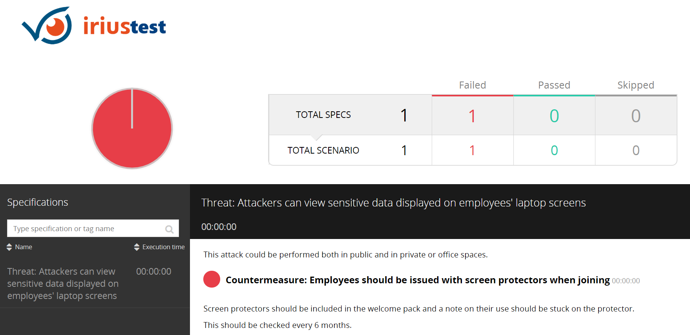

# IriusTest.core
A Threat Model as Code framework that uses the [Gauge](https://gauge.org) BDD framework to describe a threat model and to implement tests that verify the presence of countermeasures. It uses Python to implement the tests.  This is an example of how test that require human interaction can still be written as code.

## Example: Laptop screen policy
Write a security policy requirement as a Threat + Countermeasure that describes the problem and the control:

This is written in plain markdown and can include any markdown elements.  Example in threatmodel/laptop/ directory.

## Test
Then use an unnumbered list to define test steps.  Each of these test steps will map to a python function:


The first two test steps are synthetic, in that the python code does nothing.  The final step maps to a function that checks whether the last checked date is within the expiration time:


Since it isn't, the test fails.

## Why do this?
* The policy itself is markdown, so supports all the things you want in a document like images, lists, formatting, etc.
* The policy and tests are one entity, which makes this policy self-verifying.  You can execute this policy on a CI server, daily or when a security relevant event occurs.
* Test failures can trigger notifications and you can use all the plugins for reporting and notification available in your favourite CI server
* The policy and the tests are both stored in git.  This means changes to the policy and tests go through a typical request-approval workflow.  All through git.
* Verification results (in this example performed manually), are recorded in the policy itself.

Since this example test has failed, because the last verification date is more than 180 days ago, it will be corrected by someone performing the steps, checking out the policy and editing the markdown file to record their own name and the date they performed the test.  Then they submit a pull request through git - and the policy owner will accept or reject it and it goes back to the CI server.


## Run
Run the tests with:
```
gauge run threatmodel
```
